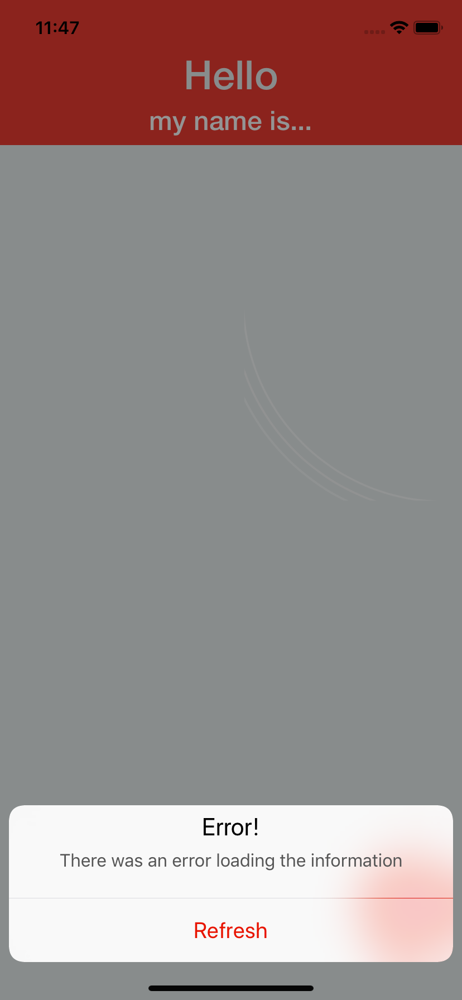

# CV App on VIPER

## What the app does?
------
The app create a request to an API and display all the information on a storyboard to simulate a resume or a CV.

## How the app works?
------
This app is  programmed on Swift 4.2 and use Xcode 10.1, also the app it's using the pattern design named VIPER for all the achitecture. The app use Codable classes to create and fetch the requets to the API.

## Why I used VIPER?
------
VIPER is one of the most application Clean Architecture used and I consider that VIPER follows the SOLID principle. Also VIPER allow work with multiple layers and any "actor" of this architecture depends of an other "actor", one of the most important thing of SOLID.

## Unit Test
------
VIPER allows create unit test for every layer of the app, so I tried to test most of all the importants layer (or actors) in this app.

## Screenshots
-------
  